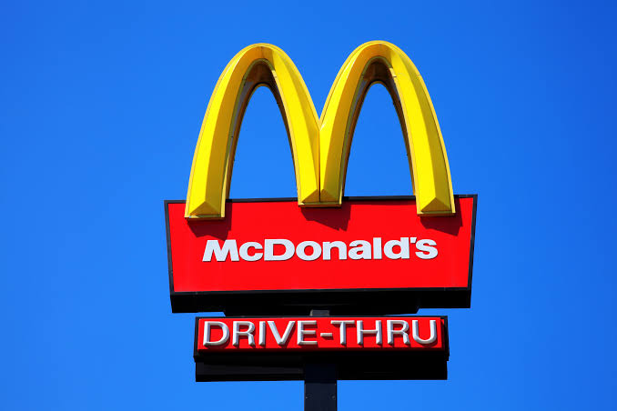
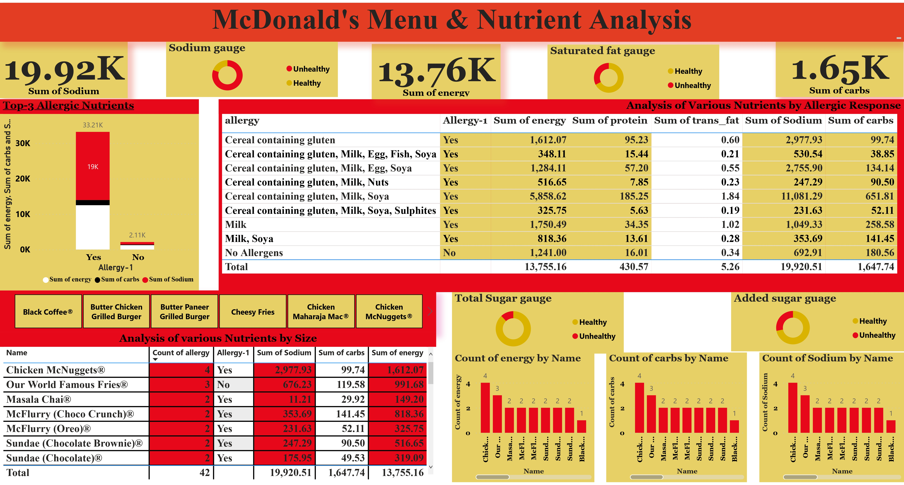

# Mcdonald-Nutrient-Analysis

## Introduction
The Chicken Nugget was invented in the 1950 by Robert C. Baker in a Laboratory in Cornell University. This menu Popularity has changed by 33.85% over the past year, this is according to Trend analysis 2023.Acccording to CDC April 21, 2017, Food allergy affects an estimated 15 Million persons in the United States and this is belief to be responsible for approximately 30,000 emergency department visit and 150-200 deaths each year hence the need to discussed and find lasting solutions to several categories of allergy cannot but be overemphasize. 
Nutritional analysis is the process of determining the nutrient content of the food sample. Over the years, McDonald is known for long standing commitment for serving safe and quality food to diverse prospective Customers around the world as this brand has carved a niche for itself. However, safe quality control and improved Food/Menu Nutrients analysis is a major challenge for a diverse restaurants like McDonald.
## Aim and Purpose of Analysis
The project is to analyze and derive insights to answer crucial and vital questions with the sole aim of helping the McDonald take a data driven decisions on food/menu safety, Nutrient Compliance & allergic response in an attempt to meet the need of diverse Customers.

## Disclaimer: All data sets and reports were source online from data bank site “Kaggle” with the sole aim of using these sets of data to gain insights and make data driven decision ditto demonstrating the capabilities of power BI. This does not in any way an attempt to discredit or disrepute the integrity, Image and market values of McDonald. It should however be noted that Branch and City name of the brand was not stated on the data bank site as well.

## Motivations and Problem Statements

The following questions among others require urgent answers towards unravelling sources of various allergic responses as presented in the data above:
- Which Nutrient has the highest Positive allergy response?
- What Menu name has the highest allergy response?
- What is the source of the allergy in the menu ingredients?
- Which of the Allergy source is most Frequent and by how much?
- Does each Nutrients meet the required and acceptable Standards?
- Which Nutrients has the Lowest Allergic response?
- What is the name of the Menu with the lowest Allergic response?

## Tasks, Skills and Concept demonstrated
The following power BI features were incorporated;
## Power query:
In an attempt to present the data for proper visualization, the data sets was transformed after been load into power Bi and the following transformations process was carried out namely:
- Headers Promotion: This was done in attempt to clean the data for proper alignment, the first role was assigned as the header.
- Column Duplication: In an attempt to categorize Allergy column into bivariate data set, the column was duplicated and the duplicate was Split by Delimiter using Space and Leftmost as reference point. The Allergy response was then Rename taking the response as either “Yes i.e. Positive” or “No i.e. Negative” for easy visualizations. (See image below)

## Data Analysis Expression (DAX): 
In an attempt to compare various nutrients value to acceptable standard, there is a need to write various DAX formula for selected nutrients. 
Ifs statements were run for each of the selected columns. This was done according to acceptable standard set by reputable Association like America Heart Association (AHA), The Institute of Medicine (IOM). See references for validation
The main objectives is to find out if these nutrients aligned with the International reference Table. The outcome is shown below
(image)

Sodium gauge = IF(mcd[Sodium]> 500, "Unhealthy", "Healthy")
added sugar guage = IF(mcd[added_sugar]> 30, "Unhealthy", "Healthy")
Total Sugar gauge = IF(mcd[total_sugar]> 60, "Unhealthy", "Healthy")
Saturated fat gauge = IF(mcd[sat_fat]> 13, "Unhealthy", "Healthy")
(image)

## Visualizations:
The analysis produces 5 visualizations as summarized in the image below:

You can Interract with the Report via this link below;
https://app.powerbi.com/links/c6QvWgagUB?ctid=0c3b6bcc-15ab-408e-b9c1-11a02205649c&pbi_source=linkShare
